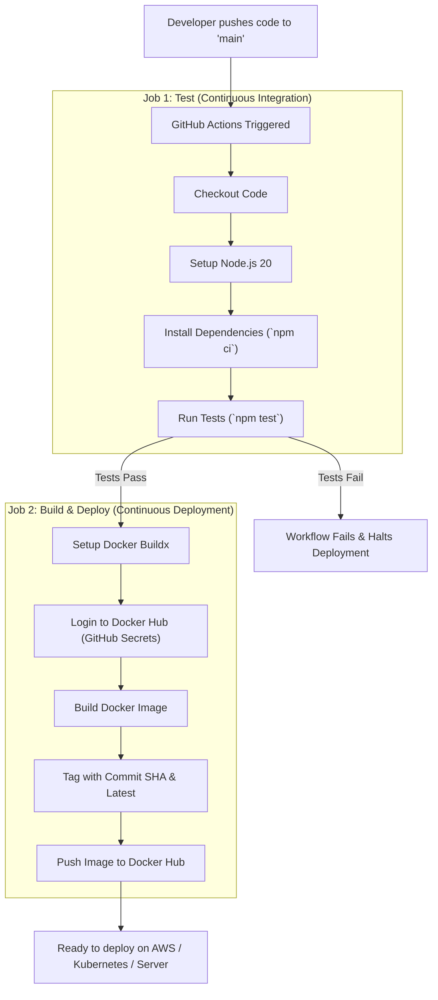
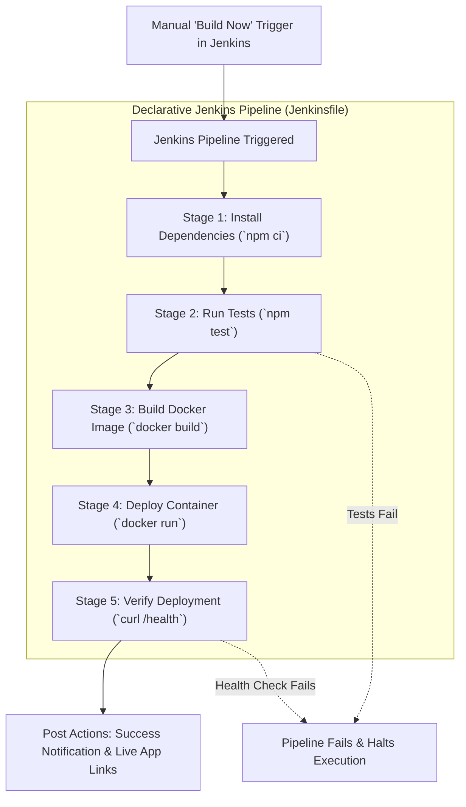

# 🚀 Node.js Demo Web App - CI/CD Pipeline with GitHub Actions & Docker Hub

> **DevOps Internship - Task 1** | **Elevate Labs**  
> **Author:** Mythreyan  
> **Repository:** `nodejs-demo-app`

---

## 📌 Project Overview

This repository demonstrates a fully automated end-to-end **Continuous Integration and Continuous Deployment (CI/CD)** pipeline for a Node.js web application using **GitHub Actions** and **Docker Hub**.

Whenever code is pushed to the `main` branch, the automated pipeline:
1. Clones the repository.
2. Installs required dependencies.
3. Executes automated unit/integration tests.
4. Containerizes the application into an optimized Docker image.
5. Pushes the Docker image to **Docker Hub** tagged with both `latest` and the commit SHA.

---

## 🏗️ Architecture & CI/CD Workflow



---

## 📂 Project Structure

```text
nodejs-demo-app/
├── .github/
│   └── workflows/
│       └── main.yml        # GitHub Actions CI/CD pipeline definition
├── src/
│   ├── app.js              # Express app definition & API endpoints
│   └── server.js           # Server bootstrap & port listener
├── test/
│   └── app.test.js         # Automated API tests using Node.js native test runner
├── .dockerignore           # Excluded files for clean Docker builds
├── .gitignore             # Git ignored files and directories
├── Dockerfile              # Multi-stage/lean production Docker image configuration
├── package.json            # Node.js project manifest & scripts
├── package-lock.json       # Deterministic dependency lockfile
└── README.md               # Project documentation & interview answers
```

---

## ⚙️ API Endpoints

| Method | Endpoint  | Description | Sample Response |
| :--- | :--- | :--- | :--- |
| `GET` | `/` | Root greeting and metadata | `{"status":"success","message":"...","version":"1.0.0"}` |
| `GET` | `/health` | Application healthcheck | `{"status":"healthy","uptime": 12.34}` |

---

## 🛠️ Local Development & Testing

### 1. Prerequisites
- **Node.js** (v18 or higher)
- **Git**
- **Docker** (optional for local container testing)

### 2. Run Locally
```bash
# Clone the repository
git clone https://github.com/<YOUR_USERNAME>/nodejs-demo-app.git
cd nodejs-demo-app

# Install dependencies
npm install

# Start the application
npm start
```
The server will start on `http://localhost:3000`.

### 3. Run Automated Tests
```bash
npm test
```

### 4. Build & Run with Docker Locally
```bash
# Build the Docker image
docker build -t nodejs-demo-app .

# Run the container
docker run -d -p 3000:3000 --name demo-app nodejs-demo-app

# Check container health
curl http://localhost:3000/health
```

---

## 🔐 GitHub Secrets Configuration

To enable automated image pushes to Docker Hub, configure the following secrets in your GitHub repository:

1. Navigate to your GitHub Repository: **Settings** > **Secrets and variables** > **Actions**.
2. Click **New repository secret** and add:
   - **`DOCKERHUB_USERNAME`**: Your Docker Hub username.
   - **`DOCKERHUB_TOKEN`**: A Docker Hub Personal Access Token (PAT).
     *(Generate on Docker Hub: Account Settings > Security > New Access Token with Read/Write permissions)*.

---

## 🤖 CI/CD Pipeline Configuration (`.github/workflows/main.yml`)

The pipeline defines two automated sequential jobs:

1. **`test` (CI)**:
   - Runs on `ubuntu-latest`.
   - Checks out the repository via `actions/checkout@v4`.
   - Caches and sets up Node.js 20 using `actions/setup-node@v4`.
   - Runs `npm ci` followed by `npm test`.

2. **`build-and-push` (CD)**:
   - Requires `test` to pass (`needs: test`).
   - Authenticates with Docker Hub using repository secrets.
   - Generates dynamic tags (`latest` and short commit SHA `${{ github.sha }}`) via `docker/metadata-action@v5`.
   - Builds and publishes the image using Buildx via `docker/build-push-action@v6`.

---

## 🔄 Task 2: Jenkins CI/CD Pipeline with Docker

This repository includes an automated **Declarative Jenkins Pipeline** ([`Jenkinsfile`](./Jenkinsfile)) configured to build, test, containerize, deploy, and verify the application on a local Jenkins automation server using Docker Desktop.

### 1. Jenkins CI/CD Architecture & Flow



### 2. Pipeline Stages Detailed

| # | Stage Name | Script / Command | Purpose |
| :--- | :--- | :--- | :--- |
| **1** | **Install Dependencies** | `bat 'call npm ci'` | Deterministically installs clean project dependencies from `package-lock.json`. |
| **2** | **Test Application** | `bat 'call npm test'` | Executes unit & integration tests using Node.js native test runner (`test/app.test.js`). |
| **3** | **Build Docker Image** | `bat 'docker build -t nodejs-demo-app:%BUILD_NUMBER% -t nodejs-demo-app:latest .'` | Compiles lean production image based on `node:20-alpine`, tagged dynamically with Jenkins build number. |
| **4** | **Deploy Container** | `bat 'docker rm -f %APP_NAME% ... docker run -d -p 3000:3000 ...'` | Idempotently stops/removes any existing container and launches the new build on port `3000`. |
| **5** | **Verify Deployment** | `bat 'ping 127.0.0.1 -n 6 >nul && curl -s -f http://localhost:3000/health'` | Wait for the container to initialize, followed by an automated HTTP ping to `http://localhost:3000/health` using `curl`. |

### 3. Jenkins Configuration Guide

1. **System Prerequisites:**
   - **Java 21 (OpenJDK / Eclipse Temurin)**
   - **Jenkins Automation Server** running at `http://localhost:8080`
   - **Docker Desktop** (Engine running with WSL2 backend)
   - **Git & Node.js**
2. **Create the Pipeline Item in Jenkins:**
   - Open Jenkins dashboard at `http://localhost:8080`.
   - Click **New Item**, enter `nodejs-demo-app-pipeline`, choose **Pipeline**, and click **OK**.
   - Under **Pipeline Definition**, select **Pipeline script from SCM**.
   - Choose **SCM**: `Git`.
   - Set **Repository URL**: `https://github.com/mythreyan26/nodejs-demo-app.git`.
   - Set **Branch Specifier**: `*/main`.
   - Set **Script Path**: `Jenkinsfile`.
   - Click **Save**.
3. **Windows 11 Compatibility Optimizations:**
   - The `Jenkinsfile` environment block automatically prepends Docker Desktop (`...\DockerDesktop\resources\bin`), Node.js, and Git to the execution `PATH`, allowing the Jenkins Windows Service to invoke `docker` and `npm` seamlessly.

### 4. How to Run & Verify the Pipeline

1. **Triggering the Build:**
   - From the `nodejs-demo-app-pipeline` dashboard, click **Build Now**.
   - Monitor the visual **Stage View** as each of the 5 stages turns green.
   - Inspect build logs via **Console Output** to verify `Finished: SUCCESS`.
2. **Verifying the Live Deployment:**
   - **Root Web Endpoint:** Visit `http://localhost:3000` to verify JSON welcome response:
     ```json
     {
       "status": "success",
       "message": "Welcome to Elevate Labs DevOps Internship - Task 1 Demo App!",
       "version": "1.0.0"
     }
     ```
   - **Healthcheck Endpoint:** The Jenkins Verify Deployment stage checks `http://localhost:3000/health` with `curl` to confirm the endpoint responds successfully.
3. **Verify via Docker CLI:**
   ```bash
   docker ps
   # Lists container 'nodejs-demo-app' running on port 0.0.0.0:3000->3000/tcp with status Up (healthy)
   ```

---

## 💡 Interview Questions & In-Depth Answers

### 1. What is CI/CD?
- **Continuous Integration (CI):** A software engineering practice where developers regularly merge code changes into a central repository, followed by automated builds and test executions. The primary goal is to identify bugs early and reduce integration friction.
- **Continuous Delivery / Continuous Deployment (CD):** 
  - *Continuous Delivery:* Code changes are automatically built, tested, and staged for release into production with a manual approval step.
  - *Continuous Deployment:* Every validated change that passes all CI stages is automatically released to production environments without human intervention.

### 2. How do GitHub Actions work?
GitHub Actions is an event-driven automation platform built directly into GitHub.
- **Workflows:** YAML files stored in `.github/workflows/` that define automation pipelines.
- **Events:** Specific activities that trigger a workflow (e.g., `push`, `pull_request`, `schedule`, `workflow_dispatch`).
- **Jobs:** A set of steps executed on the same runner. Jobs run in parallel by default unless dependency constraints (`needs:`) are declared.
- **Steps:** Individual tasks executing shell scripts or reusable pre-built actions (`uses:`).

### 3. What are runners?
A **runner** is an application/server that executes the jobs defined in a GitHub Actions workflow.
- **GitHub-hosted runners:** Pre-configured virtual machines (Ubuntu Linux, Windows Server, macOS) managed and maintained by GitHub, loaded with common tools and utilities.
- **Self-hosted runners:** Custom machines or servers hosted, secured, and maintained by your own organization, offering dedicated hardware and specialized network access.

### 4. What is the difference between jobs and steps?
| Feature | Jobs | Steps |
| :--- | :--- | :--- |
| **Execution Environment** | Runs in its own separate VM / container runner. | Runs inside the runner allocated for the parent job. |
| **Concurrency** | Runs in parallel by default (unless ordered by `needs:`). | Runs sequentially one after another. |
| **Data Sharing** | Isolated; data must be shared via artifacts or cache. | Shares the same filesystem and environment variables. |

### 5. How to secure secrets in GitHub Actions?
- **Encrypted Secrets:** Store sensitive information (API keys, passwords, access tokens) under repository or organization *Settings > Secrets and variables > Actions*.
- **Masking:** GitHub automatically masks secret values in workflow console logs.
- **Least Privilege:** Always use fine-grained Personal Access Tokens (PATs) instead of root account passwords, and grant only the permissions necessary.
- **Environment Protection Rules:** Restrict secrets to specific environments with required reviewers or branch protection rules.

### 6. How to handle deployment errors?
- **Fail-Fast & Rollbacks:** Automatically halt deployments if pre-deployment tests or healthcheck checks fail, and trigger automatic rollback to the last known stable image/version.
- **Blue/Green or Canary Deployments:** Deploy new versions alongside the current version to direct a small percentage of traffic first and monitor error rates.
- **Pipeline Alerts:** Use status badges, Slack/Discord/Email notifications via GitHub Actions steps (`if: failure()`) to alert on-call engineers.
- **Audit Logs:** Inspect detailed step execution logs inside the GitHub Actions run summary for root cause debugging.

### 7. Explain the Docker build-push workflow.
1. **Dockerfile definition:** Define base images, dependencies, build artifacts, and container entry points.
2. **Context Packaging:** Docker client packages files in the project root (respecting `.dockerignore`) and passes them to the Docker daemon/Buildx engine.
3. **Layer Caching:** Buildx builds image layers incrementally; cached layers speed up repetitive builds.
4. **Authentication:** Authenticate with Docker registry (`docker login`).
5. **Tagging:** Apply target repository namespace and tags (e.g., `username/app:latest`, `username/app:sha-123456`).
6. **Push:** Transfer layers to the container registry (`docker push`).

### 8. How can you test a CI/CD pipeline locally?
- **Using `act` (Nephrolepis/act):** A tool that runs GitHub Actions locally inside Docker containers by parsing `.github/workflows/` files.
- **Local Testing Scripts:** Execute the exact same commands locally that run in CI (`npm ci`, `npm test`, `docker build`).
- **Feature/Test Branches:** Push to a dedicated test branch in a personal fork to observe GitHub Actions runner execution before merging to `main`.

### 9. What is Jenkins, and how is it used in CI/CD?
Jenkins is an open-source automation server written in Java. In a CI/CD workflow, it can trigger and orchestrate builds, execute automated tests, package applications, and deploy artifacts.

### 10. What is a Jenkinsfile?
A `Jenkinsfile` is a text file that contains the definition of a Jenkins Pipeline written in Groovy syntax (Pipeline-as-Code). It is stored in the root directory of the application repository, enabling the CI/CD pipeline to be versioned, reviewed, and audited alongside the application source code.

### 11. How do you create and configure Jenkins pipelines?
Pipelines can be created in the Jenkins web UI by creating a **Pipeline** job and pointing it to a Git repository using **Pipeline script from SCM**. You specify the repository URL, credentials (if private), target branch (`*/main`), and the path to the `Jenkinsfile`. Jenkins automatically pulls and executes the pipeline steps defined in that file.

### 12. What are some common stages in a Jenkins pipeline?
Common stages include:
1. **Checkout / Source:** Pulling the latest code from SCM.
2. **Build / Dependencies:** Installing packages (`npm ci`) or compiling source code.
3. **Test:** Running unit, integration, and security/linting tests (`npm test`).
4. **Package / Containerize:** Building Docker images (`docker build`).
5. **Deploy:** Deploying containers or releasing to servers/Kubernetes (`docker run`).
6. **Verify / Healthcheck:** Pinging health check endpoints (`curl /health`) to ensure uptime.

### 13. What is the difference between a declarative and scripted Jenkins pipeline?
| Feature | Declarative Pipeline (`pipeline { ... }`) | Scripted Pipeline (`node { ... }`) |
| :--- | :--- | :--- |
| **Syntax** | Structured, opinionated, easy to read and maintain | Imperative Groovy scripting |
| **Validation** | Built-in syntax checks before pipeline execution starts | Validated only at runtime |
| **Error Handling** | Declarative `post` blocks (`success`, `failure`, `always`) | `try-catch-finally` programming blocks |
| **Best For** | Modern CI/CD standards, recommended for most projects | Complex logic, dynamic stages, custom loops |

